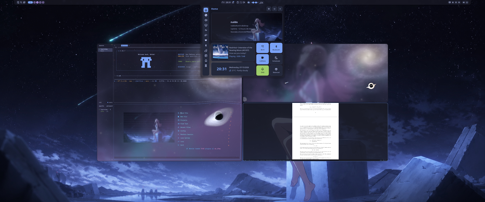

# Dotfiles

Portable Arch Linux workstation configuration for Hyprland and Niri, organized
as GNU Stow packages whose contents mirror their paths under `$HOME`.

<p align="center">
  <a href="assets/screenshots/desktop-overview.png">
    
  </a>
</p>

<p align="center">
  <em>Hyprland · Noctalia · Ghostty Cosmos · Pi Coding Agent · LazyVim · Zathura</em>
</p>

## Install

Run the complete user-level bootstrap:

```bash
./install.sh                    # prompts on a fresh interactive machine
./install.sh --profile desktop
./install.sh --profile laptop
./install.sh --non-interactive  # tracked default when no profile exists
```

It validates prerequisites and the selected profile, serializes against
`sync-all` and other dotfiles operations, enforces clean package-source
boundaries, deploys all packages, renders Niri's selected machine profile, and
initializes missing machine-local Niri, Noctalia, Fish, Zathura, and Pi files.
Re-running it is a repair operation: missing local seeds are recreated, while
existing credentials, preferences, and generated theme choices are preserved;
the selected Niri machine file is intentionally refreshed. It also enforces mode
`0600` on private files and reloads user-systemd units. It does not install Arch
packages or modify system files such as greetd.

The shared links-only reconciler used by installation and synchronization is:

```bash
./deploy-links.sh --dry-run
./deploy-links.sh
```

It restows every declared package with `--no-folding`. To remove a package's
links explicitly, use `stow --no-folding --delete PACKAGE` before deleting or
renaming the complete package source; GNU Stow has no deployment database from
which to recover an already-removed package.

`--no-folding` is required: deployed directories stay real, tracked files are
individual symlinks, and generated/private files stay physically outside the
repository. Package `.gitignore` files are source metadata and are not deployed.
Conflicting files or invalid topology stop deployment for explicit review;
links are never adopted automatically.

`desktop` owns portable desktop preferences such as `mimeapps.list`.
`automation` owns the centralized synchronization commands and user systemd
units. Herdr tracks only `~/.config/herdr/config.toml`; logs, sockets, session
history, and other runtime state stay machine-local.

## Synchronization

`./sync.sh` stages all non-ignored dotfile changes, checks whitespace, scans the
complete Git index for likely plaintext credentials, and commits. It then
reconciles Stow links for the local tree, fetches/rebases `origin/main`,
reconciles again when the integrated tree changed, reloads the user-systemd
inventory when tracked unit sources changed, and pushes. Consequently, added,
deleted, and renamed files are reflected in the live target rather than leaving
missing or dangling links. A credential, Git, or Stow conflict stops the task
before push rather than silently choosing a side or adopting a target file.

One user timer runs all repository synchronizers:

```bash
sync-control enable          # enable at login and start now
sync-control pause           # stop only for this login session
sync-control resume
sync-control interval 6h
sync-control run             # run immediately
sync-control status
```

The shared desktop scripts launcher exposes the same controls from Hyprland
and Niri, including a `1min` testing interval. Prefer `30min` or longer for
routine use. The selected
interval is machine-local and ignored by Git. Every machine uses a local
`~/backups` clone with its own Git history and remote.

The `machine` package deploys `~/.config/naldo/machine-profile/`. Its tracked
`default` is `laptop`; an optional machine-local `profile` file overrides it and
must contain `desktop` or `laptop`. The same selection generates Niri's local
`machine.kdl`, which includes the corresponding tracked output/session profile.
Fresh interactive installs choose from this tracked enum; automation uses
`./install.sh --profile PROFILE`.

## Generated themes and machine-local settings

Noctalia's rendered outputs are ignored; all durable template inputs live under
`~/.config/noctalia/templates/`. Plugin credentials belong in the real,
machine-local `~/.config/noctalia/credentials.toml` with mode `0600`;
`install.sh` initializes it from the tracked `credentials.toml.example`, after
which each machine is provisioned separately.
Noctalia loads top-level `*.toml` files, so a `credentials/` directory or Git
placeholder is unnecessary. Never enter credentials in the tracked config or
GUI-managed `settings.toml`, which is included in the guarded machine snapshot.

Ghostty's shader manager similarly keeps its active config and content-addressed
shader outputs machine-local. Missing outputs degrade safely: Ghostty and
Hyprland skip optional theme fragments, Neovim and Starship use tracked
fallbacks, Yazi uses application defaults, and Zathura keeps its tracked
behavior while an empty local `noctaliarc` leaves colors at application
defaults. Pi's extension selects built-in `dark` when `noctalia.json` is
unavailable.

Pi persists `/settings`, model, thinking, and theme selections in its active
machine-local `settings.json`. The tracked `settings.default.json` initializes a
fresh machine without pinning a provider, model, thinking level, theme, or
mutable changelog version; an existing active file is never overwritten. Fish
similarly sources ignored `~/.config/fish/local.fish` after the shared
configuration.
