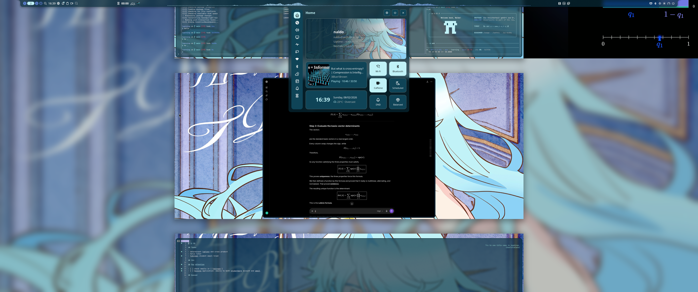

# Dotfiles

Fedora Workstation configuration for a GDM → Niri → Noctalia session, deployed
as explicit GNU Stow packages under `$HOME`.



## Start here

| Task | Entry point |
|---|---|
| Install a fresh desktop or laptop | [`bootstrap/fedora/CLEAN-INSTALL.md`](bootstrap/fedora/CLEAN-INSTALL.md) |
| Review selected providers | [`bootstrap/fedora/README.md`](bootstrap/fedora/README.md) |
| Deploy an existing checkout | `./install.sh --profile desktop` or `./install.sh --profile laptop` |
| Install the root-owned keyd integration | [`system/keyd/README.md`](system/keyd/README.md) |
| Update installed software | [`MAINTENANCE.md`](MAINTENANCE.md) |
| Inspect the Pi configuration | [`pi/.pi/agent/README.md`](pi/.pi/agent/README.md) |

For a clean Fedora installation, follow the complete guide from the beginning
rather than running the user installer first.

## Architecture

Responsibilities are deliberately separate:

- `bootstrap/fedora/` is the provider inventory and human-run installation
  sequence. It is not a machine reconciler.
- `install.sh` deploys user configuration only. It does not use sudo or install
  software.
- `install-system.sh` installs only the reviewed keyd configuration and its
  narrow udev rule.
- `automation/` owns repository synchronization and the manual `naldo-update`
  command; updates and synchronization remain separate operations.
- `tests/` validates deployment, provider ownership, profile isolation, desktop
  policy, synchronization safety, and Pi extensions.

The repository does not own GDM, the base GNOME installation, boot or graphics
setup, package-repository activation, disk mounts, credentials, or account
enrollment.

## Deployment model

Deployment requires exactly one `desktop` or `laptop` profile. The choice writes
a machine-local Niri selector for the corresponding tracked hardware fragment;
there is no additional profile layer.

Stow packages mirror their paths under `$HOME`:

```text
ghostty fish starship herdr helix zathura yazi niri lazygit noctalia
xdg-desktop-portal pi desktop automation git
```

`assets`, `bootstrap`, `system`, and `tests` are not Stow packages. Before any
change, deployment simulates the complete `--no-folding --restow` transaction.
Regular-file conflicts, symlinked target parents, and Stow errors stop the
transaction; files are never adopted automatically.

Tracked files contain portable behavior. Machine-local or private state includes
profile selectors, generated themes, application state, Git identity and trust,
credentials, SSH/GCR state, Tailscale identity, mount identity, repository paths,
and synchronization enablement. Installers initialize only missing safe defaults
and preserve existing private or generated files.

## Repository synchronization

`sync-all` supports exactly dotfiles, second-brain Notes, and Wallpapers. Paths
and enabled state live in the mode-`0600` machine-local file
`~/.config/naldo/sync/repositories.conf`.

Notes use narrow attachment-only Git LFS rules; Wallpapers store image payloads
in Git LFS. The laptop keeps `~/Wallpapers` as its worktree. The desktop links
that path to `/mnt/data/repos/Wallpapers` and requires `/mnt/data` to be a real
mount before synchronization can touch it. See
[`bootstrap/fedora/WALLPAPERS.md`](bootstrap/fedora/WALLPAPERS.md).

The timer remains disabled until all repositories, LFS checks, the applicable
mount guard, silent GCR access, and a systemd-managed run pass the clean-install
procedure. Synchronization can commit, fetch, rebase, and push.

## Tool policy

Helix (`hx`) is primary. JavaScript and TypeScript use TypeScript Language Server
plus Prettier; Python uses BasedPyright and Ruff. VS Code is a minimal scientific
fallback with Python, Jupyter, and Ruff selected directly. See
[`bootstrap/fedora/EDITOR-TOOLS.md`](bootstrap/fedora/EDITOR-TOOLS.md).

Application providers come from the six Fedora manifests; defaults come from
`desktop/.config/mimeapps.list`. Remote identity, GCR, GitHub CLI, and client-only
SSH policy are documented in
[`bootstrap/fedora/REMOTE-ACCESS.md`](bootstrap/fedora/REMOTE-ACCESS.md).

## Validation

```bash
./tests/run-tests.sh
./bootstrap/fedora/verify.sh --profile desktop
# or: ./bootstrap/fedora/verify.sh --profile laptop
```

The verifier reports selected packages and provider ownership, commands, desktop
files, Flatpaks, editor tools, fonts, tracked outputs, and units without making
changes.
